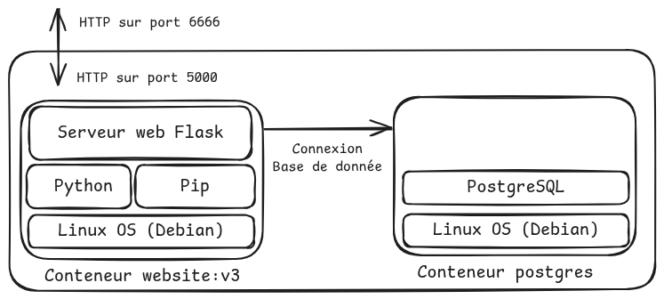
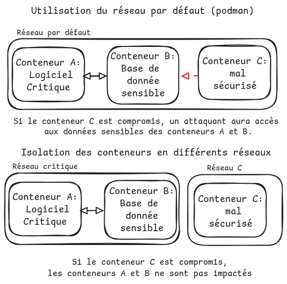

# TP3 Multi-conteneurs et docker compose

Jusqu'à présent notre superbe site se reposait sur un fichier JSON ou l'outil SuperDB pour stocker ses données.

Seulement, ces deux méthodes ne permettent pas d'accèder en parallèle à la base de donnée de manière sûre. Seulement, la popularité de notre site monte en flèche, et il sera bientôt nécessaire d'avoir plusieurs instances du site en parallèle pour supporter la demande.

Pour cela, nous décidons d'utiliser une base de donnée qui supporte les accès parallèles, et bien plus : Postgres. Cette base de donnée s'exécutera dans son propre conteneur. Les conteneurs du site et de la base de données devront communiquer entre eux.

L'architecture finale sera la suivante :

Avant de vous lancer, nous allons voir comment faire en sorte que deux conteneurs puissent communiquer ensemble.

- Cloner ce dépôt : `git clone https://github.com/hreymond/VIR/`
- Entrer dans le répertoire du TD3 : `cd TD3-multi-containers`

## Communication entre conteneurs

Pour comprendre comment fonctionne le réseau, nous utiliserons la troisième version du site, dont l'image Docker contient des utilitaires réseau (ping, ip, ifconfig)

- Changer de dossier `cd website` 
- Construire l'image `website:v3` : `docker build . -t website:v3`

Ensuite, nous allons tenter de ping un conteneur depuis un autre : 

- Créer un conteneur de `website:v3`, en mode interactif nommé A : `docker run -it --rm --name A website:v3`
- Dans un autre terminal, créer un autre conteneur nommé B : `docker run -it --rm --name B website:v3`

Vous obtiendrez alors un terminal à l'intérieur du conteneur A et du conteneur B.
À partir de là, récuperer l'adresse IP de B et faire un ping de A vers B.

## Mise en réseau de conteneurs

> [!NOTE] 
>
> **Mise en réseau de conteneurs**
>
> Conteneurs ont besoin d'accéder à internet. 
> Les nouveaux conteneurs rejoignent le sous-réseau par défaut de podman, nommé `podman`. C'est grâce à ce sous réseau qu'il est possible de ping une machine depuis une autre.
> 
> En pratique, lorsque l'on cherche à connecter plusieurs conteneurs, on évite d'utiliser le réseau par défaut et on préfère créer un nouveau réseau.
> 
> En effet, si tous les conteneurs partagent le même réseau, cela présente des problématiques de sécurité.
> Dans l'exemple ci-dessous, deux application A et B partagent le même réseau. Si l'application B est compromise, cela représente une faille pour l'application A.
>
>  
> 
> De plus, le réseau par défaut de podman ne contient pas de DNS, et ce dernier nous serait utile pour accéder aux conteneurs par le nom, plutôt que leurs IPs.
> 
> Pour gérer le réseau avec podman, on utilise la commande `podman network`.
> 
> - `podman network ls` : Liste les réseaux existants
> - `podman network inspect <network_name>` : Inspecte les propriétés du réseau network_name
> - `podman network create <network_name>` : Crée un nouveau réseau, appelé network_name
> 

- Arrêter les conteneurs A et B (Utiliser Ctrl-D ou taper la commande `exit`) 
- Créer un nouveau réseau `website-net`
- Dans deux terminaux différents, créer deux conteneurs A et B, qui se connectent au réseau nouvellement créé (paramètre `--network`) :
    - `docker run -it --network website-net --rm --name A website:v3`.
    - `docker run -it --network website-net --rm --name B website:v3`
- Dans un autre terminal, créer un conteneur C, qui n'est pas connecté à `website-net` :  `docker run -it --rm --name C website:v3`

- Afficher les ips de chacun des conteneurs. On observe que A et B sont sur les mêmes sous-réseaux, et C sur un autre.

Vérifier que :
- Le conteneur A peut accéder au conteneur B via son ip
- Le conteneur C ne peut accéder ni à A, ni à B

Notre sous réseau `website-net` fourni un DNS par défaut. Verifier qu'il est désormais possible :
- Que le conteneur A accède au conteneur B via son ID (accessible via `docker ps`)
- Que le conteneur A accède au conteneur B via le nom du conteneur : `ping B`

# TODO 

- [ ] Ajouter liaison Postgresql
- [ ] Ajouter docker-compose
- [ ] Demander extensions à 4 -> Connecter le frontend au voisins
