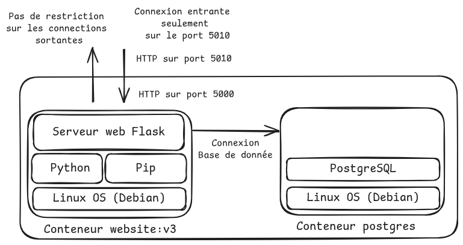

# TP3 Multi-conteneurs et docker compose

Jusqu'à présent notre superbe site se reposait sur un fichier JSON ou l'outil SuperDB pour stocker ses données.

Seulement, ces deux méthodes ne permettent pas d'accèder en parallèle à la base de donnée de manière sûre. Seulement, la popularité de notre site monte en flèche, et il sera bientôt nécessaire d'avoir plusieurs instances du site en parallèle pour supporter la demande.

Pour cela, nous décidons d'utiliser une base de donnée qui supporte les accès parallèles, et bien plus : Postgres. Cette base de donnée s'exécutera dans son propre conteneur. Les conteneurs du site et de la base de données devront communiquer entre eux.

L'architecture finale sera la suivante :



Avant de vous lancer, nous allons voir comment faire en sorte que deux conteneurs puissent communiquer ensemble.

- Cloner ce dépôt : `git clone https://github.com/hreymond/VIR/`
- Entrer dans le répertoire du TD3 : `cd TD3-multi-containers`

## Communication entre conteneurs

Pour comprendre comment fonctionne le réseau, nous utiliserons la troisième version du site, dont l'image Docker contient des utilitaires réseau (ping, ip, ifconfig)

- Changer de dossier `cd website` 
- Construire l'image `website:v3` : `podman build . -t website:v3`

Ensuite, nous allons tenter de ping un conteneur depuis un autre : 

- Créer un conteneur de `website:v3`, en mode interactif nommé A, dans lequel vous exécuterez la commande bash : `podman run -it --rm --name A website:v3 bash`
- Dans un autre terminal, créer un autre conteneur nommé B : `podman run -it --rm --name B website:v3 bash`

Vous obtiendrez alors un terminal à l'intérieur du conteneur A et du conteneur B.

:question: À quoi correspondent chacune des options que vous avez indiqué à `podman run` ? 

Afficher la configuration IP des deux conteneurs. 

:question: À partir de cette configuration que pouvez-vous conclure ? 

## Mise en réseau de conteneurs

> [!NOTE] 
>
> **Mise en réseau de conteneurs**
>
> À leur création, les conteneurs rejoignent un réseau pour obtenir un accès Internet. Ils peuvent effectuer des connexions sortantes (accès à Internet), mais les connexions entrantes (de l'hôte vers le conteneur) sont bloquées. 
>
> :question: Quel paramètre, utilisé lors de la création du conteneur, permet d'autoriser les connexions entrantes sur un port spécifique ?
>
> Au démarrage de podman, il n'existe qu'un seul réseau, nommé `podman`. Par défaut, c'est le réseau que rejoindront les conteneurs à leur création.
>
> Podman laisse à l'utilisateur la possibilité de créer et de gérer de nouveaux réseaux :
> - `podman network ls` : Lister les réseaux existants
> - `podman network inspect <network_name>` : Inspecter un réseau
> - `podman network create <network_name>` : Créer un réseau
> 
> Pour ajouter un conteneur à un réseau nommé `network_name`, on peut utiliser l'option `--network network_name` à la création du conteneur.
>

- Lister les réseaux existants, et inspecter le réseau par défaut, nommé `podman`

:question: Que pouvez-vous constater sur la configuration par défaut ?

> [!NOTE] 
>
> **Pourquoi isoler les réseaux ?**
>
> Si tous les conteneurs partagent le même réseau, cela présente risque de sécurité. En effet, si un attaquant arrive à prendre le contrôle d'un conteneur dans le réseau, il peut :
> - Observer tout le trafic réseau
> - Interagir avec des conteneurs critiques
>
> Ce scénario est illustré ci-dessous :
> 
> 
>
> 

Pour prendre en main ces problématique réseau, nous allons mettre en place l'isolation de deux conteneurs A et B du réseau de base, `podman`

- Arrêter les conteneurs A et B (Utiliser Ctrl-D ou taper la commande `exit`) 
- Créer un nouveau réseau `safe-net`
- Dans deux terminaux différents, créer deux conteneurs A et B, qui se connectent au réseau disponible  (paramètre `--network`) :
    - `docker run -it --network <nom> --rm --name A website:v3 bash`.
    - `docker run -it --network <nom> --rm --name B website:v3 bash`
- Dans un autre terminal, créer un conteneur C, qui n'est pas connecté à `website-net` :  `docker run -it --rm --name C website:v3 bash`

- Inspecter le nouveau réseau `safe-net`

:question: Quelles différences pouvez-vous faire entre le réseau de base, et votre réseau `safe-net` ? Qu'est-ce que cela implique ?

:question: Vous avez nommé vos deux conteneurs A et B, sauriez-vous retrouver ces noms dans le conteneur ? Histoire de savoir comment je m'appelle ?

Vérifier que :
- Le conteneur A peut pinguer le conteneur B via son ip
- Le conteneur C ne peut accéder ni à A, ni à B
- Que le conteneur A peut pinguer le conteneur B via son ID (accessible via `podman ps`)
- Que le conteneur A peut pinguer le conteneur B via le nom du conteneur : `ping B`

## Utiliser de multiples conteneurs avec Podman

Maintenant que vous savez mettre en réseau deux conteneurs, il est temps de relier notre site à une base de donnée postgres.

Le site essaiera de se connecter à la base de donnée avec ces paramètres :
- Adresse de la BDD : `postgres`
- Mot de passe : `admin`

> [!NOTE]
> 
> **Variables d'environnement**
> 
> Il est courant de passer des variables d'environnement à un conteneur pour le configurer : choisir entre le mode débug et le mode production, définir l'adresse sur laquelle le serveur devra écouter.
> 
> Pour cela, on peut utiliser l'option `-e` de la commande `docker run` 
> 
> Par exemple, postgres demande à l'utilisateur de définir la variable d'environnement `POSTGRES_PASSWORD` au lancement de la base de donnée

Démarrer deux conteneurs à partir des images suivantes : `postgres` (notre base de donnée) et `website` (notre site). Faire en sorte que notre site puisse se connecter à la base de donnée postgres.

:question: Comment vérifier que notre conteneur `website` soit sur le même réseau que le conteneur `postgres` ? Comment vérifier qu'il est possible d'accéder au conteneur via le nom de domaine `postgres` ? 

:question: Est-ce que le réseau par défaut (`podman`) permettrait d'accéder à l'adresse `postgres` ? Pourquoi ?

## Automatiser la gestion de multiples conteneurs avec podman compose

Démarrer de multiples conteneurs à la main comme nous l'avons fait est source d'erreurs et est très chronophage. C'est pourquoi, pour tester les interactions entre divers conteneurs, on utilise des outils comme `podman compose`.

> [!NOTE]
> 
> **Podman compose**
>
> L'outil `podman compose` permet de lancer et paramétrer plusieurs conteneurs à partir d'un fichier descriptif, nommé `compose.yaml`
>
> Voici un exemple de `compose.yaml`
> 
>```yaml
>services:
>  website:
>    image: website:v3
>    ports:
>      - "5010:5000"
>    depends_on:
>      - postgres
>
>  postgres:
>    image: postgres
>    environment:
>      POSTGRES_PASSWORD: admin
>    volumes:
>      - db_data:/var/lib/postgresql/
>
>volumes:
>  db_data:
>```
>
> Notre `compose.yaml` est séparé en deux sections : `services` et `volumes`.
> 
> La première section, `services`, permet de définir les conteneurs qui seront lancés, ansi que leur configuration. Ici, on retrouve nos deux conteneurs et leur configuration (redirection de port, variable d'environnement). En plus des paramètres évoqués précédemment dans le sujet, on indique via l'argument ` depends_on:\n - postgres` que le conteneur website doit être lancé après le conteneur postgres. :warning: Attention, il ne faut pas confondre les services podman-compose avec les services dont nous parlerons dans les TDs Kubernetes.
> 
> La seconde section, `volumes`, définit les volumes qui seront utilisés dans le déploiement. Ici, on définit le volume `db_data`, qui est utilisé par le conteneur `postgres`
> 
> Ce podman-compose est assez minimal. En réalité, il existe bien plus de paramètres présentés dans la [documentation des compose file](https://docs.docker.com/reference/compose-file/).

Démarrons notre déploiement à l'aide de podman compose :

- `podman compose up`

:question: Comment sont nommés les conteneurs créés ? À quel réseau sont-il attachés ?

Supprimer le déploiement

- `podman compose down`

Notre site est presque prêt ! Il lui manque un dernier élément essentiel : des sauvegardes de la base de donnée. 

Pour cela, on ajoutera un conteneur nommé db-utils, basé sur l'image postgres. Ce conteneur n’expose aucun port, mais doit pouvoir :
- se connecter à la base de données postgres pour faire un backup
- utiliser un volume différent de `db_data` pour stocker les résultats
- démarrer après la base de données

Pour éviter l'exécution de la commande de base du conteneur `postgres`, qui démarre une base de donnée, on écrasera la commande de lancement avec l'argument `command: ["sh", "-c", "pg_dump > /backup/backup.sql"]`. Au préalable, on aura défini différentes variables d'environnement :

- PGPASSWORD = admin
- PGUSER = postgres
- PGHOST = postgres

À votre tour de jouer ! Ajoutez le conteneur db-utils au `compose.yaml`

# Liste des commandes utilisées
```
podman run -it --rm --name <nom> <tag> --> A quoi correspondent les options utilisées
podman network
ping
```