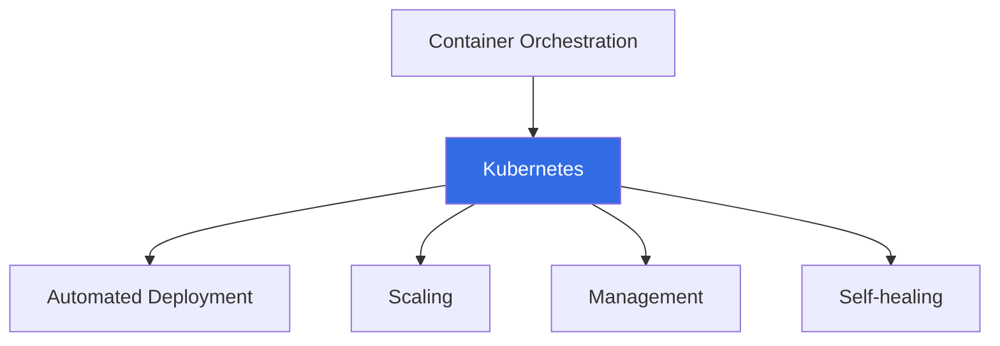
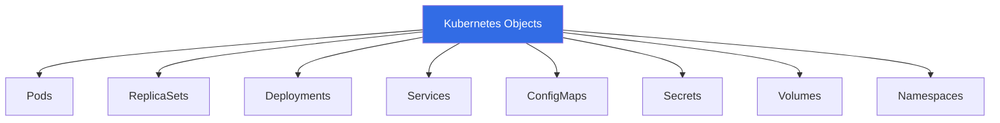

# TD4 - Kubernetes start

Objectif du TD :
- :dart: Démarrer kubernetes / k3s dans un environnement maitrisé
- :dart: Prendre en main les premières commandes kube

## Partie 1 : Lancement
Nous avons installé sur les clés les outils permettant de démarrer une infrastructure [kubernetes](https://kubernetes.io/docs). 
Il existe de nombreuses implantations de Kubernetes et comme Kubernetes est principalement spécifié via ses API elles sont assez interchangeable. 
Nous avons fait le choix d'utiliser [k3s](https://k3s.io/). A partir de maintenant, quand nous parlerons de Kubernetes, nous sous-entendrons souvent
l'implantation spécifique utilisée (ici k3s).


### Démarrer k3s
k3s est présent sur la clé. Vous allez donc pouvoir le lancer et le manipuler. Mais avant cela il faut comprendre la notion de services. 

L'objectif de Kubernetes est de fournir une infrastructure d'exploitation (Run) large échelle offrant des garanties d'exécution 24/7. Pour cela, l'infrastructure fonctionne de manière autonome et va se placer au dessus de votre système d'exploitation comme le ferait une machine virtuelle. On peut assimiler cela à un gestionnaire de machines virtuelles, a la différence que la granularité d'exploitation n'est pas une machine mais un conteneur au sens de Docker. 
Le schéma suivant illustre les objectifs de Kubernetes.


Dans ce cadre, le gestionnaire doit fonctionner comme tâche de fond du système d'exploitation. Tous les systèmes d'exploitation (Linux, Windows, Mac) offrent une (ou plusieurs) applications de gestion de ces tâches de fond. Il s'agit des [Services windows](https://fr.wikipedia.org/wiki/Service_(Windows)) dans windows ou du système `launchd` sous Macos. Sous Linux/Unix il en existe plusieurs en fonction de la distribution utilisée. Un gestionnaire de service doit pouvoir lancer, arrêter et surveiller un service. Par ailleurs, il doit pouvoir définir s'il doit être lancé systématiquement au démarrage ou uniquement selon des besoins spécifiques. Enfin, avant de pouvoir lancer un service, il est nécessaire de vérifier que les services, les drivers ou les processus dont ils dépend sont disponibles. Lancer un 'service' n'est pas simple et c'est pourquoi les outils de gestion de services ne sont pas si simples qu'ils n'y parraissent. Debian utilise [systemd](https://medium.com/@sebastiancarlos/systemds-nuts-and-bolts-0ae7995e45d3) comme remplaçant à initd (Une excellente présentation des systèmes d'init peut se trouver [ici](https://hal.science/inria-00155663/) quoi qu'elle date un peu). Lorsque vous démarrez votre clé USB, vous voyez rapidement les différents services se lancer. Systemd repose sur les commande `systemctl` ou `journalctl` disponibles sur votre machine. Par exemple la commande `systemctl list-unit-files` liste les services et leur état actuel. La commande `journalctl -uf <nomdeservice>`permet de suivre les traces de logs d'un service. 

:question: Utilisez `journalctl` pour tracer l'activité de ssh, et montrez que vous obtenez des traces sur certaines actions. 

L'installation que nous avons fait de k3s, est une installation sans démarrage automatique du service. La commande d'installation initiale que nous avons réalisé sur la clé est donc `INSTALL_K3S_SKIP_ENABLE=true ./install-k3.sh`. Les variables disponibles pour k3s sont [ici](https://docs.k3s.io/reference/env-variables). Le service existe, mais il n'est pas démarré comme un service. Dans le cadre du cours, nous n'allons pas l'utiliser comme un service mais directement dans une fenêtre en appelant le shell `startk3sServer.sh`.

:question: Ouvrez le shell et vérifier la commande   
:question: Démarrez le shell et vérifiez que les logs fonctionnent   
:question: Arrêter le processus k3s en faisant un CTRL-C dans la fenêtre   

Nous ne passons pas par un service, car toutes les actions précédente sont plus complexes en passant par systemd. Mais sauriez-vous les retrouver ?


:boom: A partir de maintenant vous allez travailler en root sur votre machine. Dans chaque fenêtre, vous pouvez faire un `sudo su -` pour basculer en mode admin. 

Une fois k3s lancé dans une fenêtre dédiée, vous pouvez vérifier que tout s'est bien lancé en lançant les commandes suivantes dans une nouvelle fenêtre. (Certaines commandes ne sont pas indiquées vous devez les trouver par vous même). Pensez-bien à les effectuer en tant qu'admin, mais n'hésitez-pas à les tester en tant qu'utilisateur standard pour voir s'il y a un message d'erreur. 

```
kubectl cluster-info /* Vous indique l'état du cluster, vous devriez voir
                        l'adresse du controle-pane, 
                        du service core-DNS,
                        et du serveur de metriques. */
```

Vous avez compris, que `kubectl` est la CLI d'interaction avec kubernetes. Elle ne dépend pas de k3s, mais de la spécification générale. C'est par cette interface que vous pouvez passez la majorité de vos instructions en ligne de commande. Notez également que nous avons installé la complétion des commande pour kubectl quand vous tapez `kubectl <TAB><TAB>`, vous avez la suggestion des mots clés suivants. 

```
kubectl get nodes /* Vous indique les noeuds participants à votre cluster */
---> debian Ready control-pane 3m v1.34.3+k3s1 indique que j'ai un noeud debian actif
```

```
kubectl get pods    /* Renvoie une liste vide */
kubectl get pods -A /* Renvoie une liste de pods, dont 2 'non prêt' *./
```
Nous reviendrons là dessus, mais les deux commandes diffèrent, car à l'instar de votre machine, vous avez un mode 'user-space' et un mode 'system'. Le paramètre `-A` accède à l'intégralité des informations. 

Il vous reste deux commandes à tester. La première regarde les processus lancés et actifs, la seconde présente l'état de votre réseau... 
Au fait:question: Connaissiez-vous la partie réseau avant de démarrer k3s ? 

:question: Quelles sont les commandes à soumettre ?

Normalement, à cette étape, votre système kubernetes fonctionne. Il est prêt à exécuter recevoir des instructions. Ce qu'on appelle 'instructions' ce sont des documents de description de ce que vous allez faire exécuter dans votre infrastructure. D'une manière générale il peut s'agir de composants réalisant des tâches, de services permettant d'exposer l'accès à ces tâches, de lieu de stockage... La figure suivante indique les différents artefacts de description que vous pouvez définir. 



Nous vous suggérons de rebooter votre machine pour voir si vous atteignez ce point sans difficulté.   
Si vous ne rebootez pas et si vous n'êtes pas certain d'avoir tout arrêté proprement, k3s vous fournit un script de nettoyage complet `k3s-killall.sh` réalise un ménage assez complet de k3s. 

### Un premier déploiement
Nous pouvons maintenant tester un premier déploiement d'objets kubernetes. Le fichier suivant est le descripteur d'un objet de déploiement(Deployment) et d'un service(Service). Le fichier est au format yaml, prenez le temps de lire les différents élements et de vérifier que la syntaxe vous parait claire. Par exemple, à quoi sert le `-` en début de certaines section ?

```yaml
# Simple application with service
apiVersion: apps/v1
kind: Deployment
metadata:
  name: demo-app
spec:
  replicas: 3
  selector:
    matchLabels:
      app: demo
  template:
    metadata:
      labels:
        app: demo
    spec:
      containers:
      - name: web
        image: nginx:1.19
        ports:
        - containerPort: 80

---
apiVersion: v1
kind: Service
metadata:
  name: demo-service
spec:
  selector:
    app: demo
  ports:
  - port: 80
    targetPort: 80
  type: ClusterIP
```

:question: Selon vous, que fait cette description ? Par exemple, avez-vous identifié un lien avec Docker ?

Pour installer cette description vous pouvez déclarer un ou deux fichiers de description. Le séparateur `---` permet de séparer deux descriptions qui sont traitées de manière indépendante. Pour déployer une description l'instruction est `kubectl apply -f <fichierdescripton.yaml>`.

Si tout s'est bien passé, vous pouvez vérifier que la déclaration s'est bien réalisé avec les constats et instructions suivantes : 

Le résultat de l'appel devrait être  :
```
deployment.apps/demo-app created
service/demo-service created
```

Vous pouvez vérifier plusieurs choses.

- Combien de réplicats du service ont-ils été déployés ?  `kubectl get pods`
Modifiez le nombre de replicats dans le descripteur et vérifiez que le nombre de replicats s'adapte automatiquement. 

- Vérifiez que le service est bien installé.  `kubectl get services`

- Enfin, vérifiez que le déployement est bien présent. `kubectl get deployment`

### Utilisation
En utilisant la commande `kubectl describe service <nom-service>`, essayez de trouver comment accéder à un des réplicats de serveur Web. 

:question: Comment pouvez-vous tester ce déployement à partir de votre hôte ?

La commande `kubectl describe <descripteur> <nom>` permet d'obtenir une description de tous les artefacts déployés dans votre infrastructure. Vous pouvez, par exemple l'utiliser pour consulter la description d'un des pods. 

### critctl
La commande `critctl` est une commande équivalente à la commande `podman` ou `docker`. Elle permet de consulter l'état des conteneur et des images de votre cluster Kube. 
Par exemple `critcl ps` liste l'état de vos conteneurs. 

:question: Sauriez vous modifier un de vos replicats en le forçant à afficher une page simple, puis vérifier qu'un de vos site web affiche quelque chose de différent ?

### kubectl run
:question: Que fait la commande suivante `kubectl run curl --image=curlimages/curl -i --rm --restart=Never -- curl demo-service` ?

A partir de ce que vous avez compris de crictl, lancez un `curl demo-service` sur un des pods. 

### Quelques dernières commandes à tester
`kubectl describe pod <pod-name>`    
`kubectl logs <pod-name>`, vérifiez que vos serveurs web ont bien fonctionné.  
`kubectl exec -it <pod-name> -- <cmd>`, testez que la commande curl existe, puis lancez la commande `curl demo-service`sur un des pods ngnix.    

A cette étapes quelles sont vos analyse de Kubernetes par rapport à Docker, voyez-vous des éléments de similitude ou de différence ?

### Nettoyage
Vous pouvez supprimer des Objets Kubernetes avec la commande `kubectl delete <objettype> <objectname>`

:question: Listez vos pod, supprimez un des pods actifs, et re-listez vos pods. Que se passe-t'il ?

La commande `kubectl get all` permet de lister tout ce qui tourne sur la machine. 
Pour fini la commande `kubectl top pod` vous permet de voir l'espace utilisé par chacun de vos pods.

---> SI VOUS ETES ARRIVEZ ICI, C'EST PARFAIT !

# Liste des commandes utiles
```
systemctl list-unit-files
journalctl -uf <nomdeservice>

k3s-killall.sh

kubectl cluster-info
kubectl get nodes
kubectl get pods
kubectl get pods -A
kubectl get services
kubectl get deployment
kubectl describe service <nom-service>
kubectl run <containerSpec>
kubectl logs <pod-name>
kubectl exec -it <podname> -- <cmd>
kubectl top pod

critctl ps
```
