# Kubernetes Fundamentals and Service Mesh
## Core Concepts and Architecture

Session 2

<!--
- Welcome to the second session of our Kubernetes course
- Today we'll dive deeper into Kubernetes architecture and fundamentals
- We'll cover crucial concepts like workloads, networking, configuration, and more
- This knowledge builds on the containerization concepts from our previous session
- The skills gained today form the foundation for implementing service mesh
-->

---

# Session Agenda

- What is Kubernetes?
- Cluster Architecture
- Container Images in Kubernetes
- Workloads and Autoscaling
- Services and Networking
- Storage Fundamentals
- Configuration Management
- Observability in Service Mesh

<!--
- Our session is structured to cover core Kubernetes concepts first
- We'll begin with Kubernetes fundamentals and architecture
- Middle sections focus on practical aspects: workloads, networking, and storage
- Final sections cover configuration and observability
- Each section builds on the previous one
- Feel free to ask questions throughout the session
- We'll keep practical examples relevant to our upcoming lab sessions
-->

---

# What is Kubernetes?

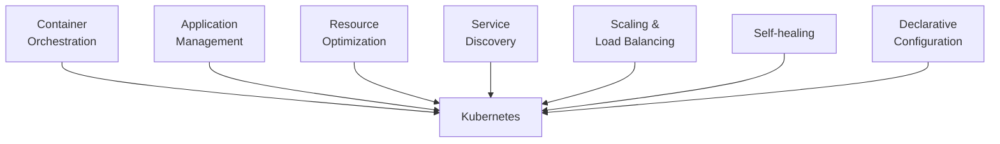

<!--
- Kubernetes fundamentals (10 min):

  - Core definition:
    - Open-source container orchestration platform
    - Originally developed by Google, now maintained by CNCF
    - Name comes from Greek word for "helmsman" or "pilot"
    - Often abbreviated as "K8s" (K + 8 letters + s)
    - Released in 2014, based on Google's internal Borg system

  - Main purpose:
    - Automates deployment, scaling, and management of containerized applications
    - Provides declarative configuration (define desired state)
    - Handles scheduling containers across compute resources
    - Manages application lifecycles
    - Implements self-healing mechanisms

  - Key benefits:
    - Portable: runs anywhere (cloud, on-premises, hybrid)
    - Extensible: modular design with plugins and APIs
    - Self-healing: automatically replaces failed containers
    - Automatic scaling: horizontal and vertical
    - Service discovery and load balancing built-in
    - Storage orchestration: mount storage systems
    - Automated rollouts and rollbacks of changes

  - Limitations:
    - Complexity: steep learning curve
    - Resource overhead: not ideal for very small deployments
    - Stateful applications need special handling
-->

---

# Kubernetes Cluster Architecture

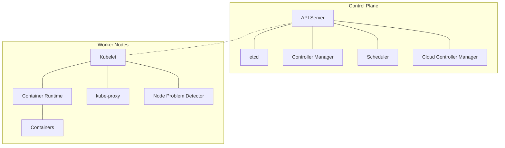

<!--
- Kubernetes architecture (15 min):

  - Control plane components:
    - API Server: frontend for Kubernetes control plane
      * All communications go through API Server
      * Validates and processes REST operations
      * Updates etcd with state changes
    
    - etcd: consistent and highly-available key-value store
      * Stores all cluster data and state
      * Single source of truth for the cluster
      * Critical for disaster recovery
    
    - Controller Manager: runs controller processes
      * Node controller: monitors node health
      * Replication controller: maintains pod count
      * Endpoint controller: joins services and pods
      * Service account & token controllers: access control
    
    - Scheduler: watches for new pods, assigns to nodes
      * Considers resource requirements
      * Quality of Service (QoS) constraints
      * Affinity/anti-affinity specifications
      * Data locality and hardware constraints
    
    - Cloud Controller Manager (optional):
      * Links cluster to cloud provider APIs
      * Manages cloud-specific resources (load balancers, routes)

  - Node components:
    - Kubelet: agent that ensures containers run in pods
      * Communicates with API server
      * Manages container lifecycle
      * Reports node and pod status
      * Runs container liveness/readiness probes
    
    - Container Runtime: software executing containers
      * containerd, CRI-O, Docker (deprecated as runtime)
      * Implements Container Runtime Interface (CRI)
    
    - kube-proxy: network proxy on each node
      * Implements part of Kubernetes Service concept
      * Maintains network rules for pod communication
      * Performs connection forwarding
    
    - Node Problem Detector: monitors node health
      * Reports node problems to API server
      * Can be extended for custom health checks

  - cgroups (control groups):
    - Linux kernel feature used by container runtimes
    - Limits and accounts for resource usage (CPU, memory, disk I/O, network)
    - Kubernetes relies on cgroups for resource constraints
    - Used for QoS classes (Guaranteed, Burstable, BestEffort)
-->

---

# Communication Patterns

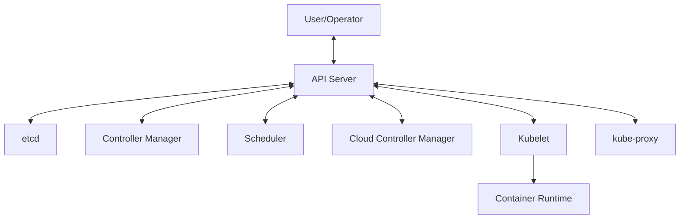

<!--
- Communication between components (7 min):

  - Control plane communications:
    - All components communicate through API server
    - No direct component-to-component traffic
    - API server is the only component to talk to etcd
    - Controller manager and scheduler watch API server for changes
    - Components use Kubernetes API with RESTful interface
  
  - Node-to-control plane:
    - Kubelet initiates connection to API server
      * Reports node and pod status
      * Receives pod specifications
      * Uses TLS certificates for authentication
    - kube-proxy watches API server for service changes
    - Control plane never directly connects to nodes
    - Security benefit: no inbound ports needed on nodes
  
  - External access patterns:
    - kubectl commands go to API server
    - Authentication and authorization at API server
    - All actions recorded in audit logs
    - API server is the single entry point for cluster management

  - Network security:
    - Control plane typically on private network
    - API server usually exposed with TLS
    - Node connections secured with certificates
    - Pods communicate through cluster network
-->

---

# Container Images in Kubernetes

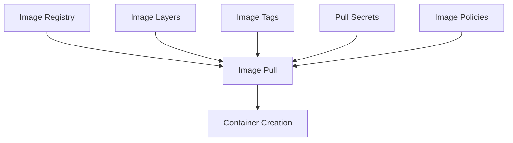

<!--
- Container images in Kubernetes (10 min):

  - Image fundamentals:
    - Self-contained packages with application and dependencies
    - Layered filesystem for efficiency
    - Immutable: once built, cannot be changed
    - Based on OCI (Open Container Initiative) standards
    - Specified in pod container specification
  
  - Image registries:
    - Public: Docker Hub, Google Container Registry, GitHub
    - Private: Harbor, Nexus, cloud provider registries
    - Self-hosted options for sensitive environments
    - Registry authentication using imagePullSecrets
  
  - Image naming and versioning:
    - Format: [registry]/[repository]/[image]:[tag]
    - Examples:
      * nginx:1.19.0
      * gcr.io/google-samples/hello-app:1.0
      * myregistry.azurecr.io/myapp:latest
    - Best practices:
      * Avoid using "latest" tag in production
      * Use semantic versioning for tags
      * Consider using image digests for immutability
  
  - Image pull policies:
    - Always: always pull image (default if :latest tag)
    - IfNotPresent: pull only if not present locally
    - Never: never pull, use local only
  
  - Optimization techniques:
    - Use multi-stage builds to reduce image size
    - Leverage layer caching effectively
    - Remove unnecessary tools and files
    - Consider distroless or minimal base images
    - Use image pull caching for faster deployments
-->

---

# Workloads and Controllers

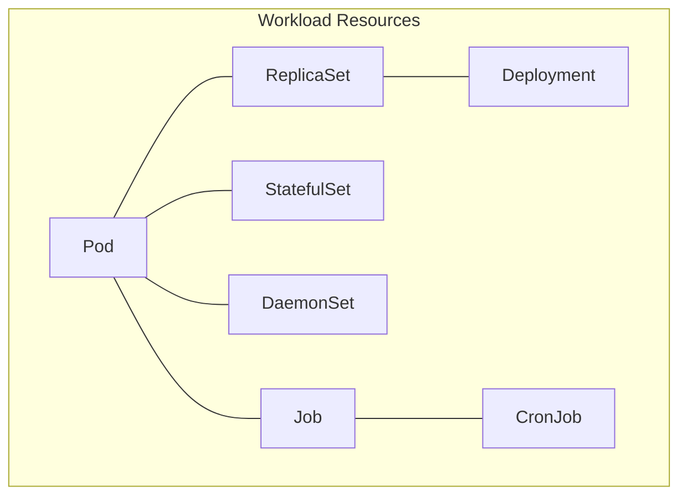

<!--
- Workloads in Kubernetes (10 min):

  - Pod:
    - Smallest deployable unit in Kubernetes
    - Contains one or more containers sharing resources
    - Has its own IP address and storage volumes
    - Containers in same pod share network namespace
    - Usually managed by controllers, not directly created
    - Example use case: main application + helper sidecar
  
  - ReplicaSet:
    - Ensures specific number of pod replicas are running
    - Provides self-healing through automatic replacements
    - Identifies pods using label selectors
    - Usually managed by Deployments rather than directly
  
  - Deployment:
    - Provides declarative updates to applications
    - Manages ReplicaSets for scaling and updates
    - Supports rolling updates and rollbacks
    - Records revision history for easy rollback
    - Most common way to deploy applications
  
  - StatefulSet:
    - Manages stateful applications like databases
    - Provides stable network identities
    - Ordered, graceful deployment and scaling
    - Stable, persistent storage per pod
    - Example use case: distributed databases (MySQL, MongoDB)
  
  - DaemonSet:
    - Ensures all (or some) nodes run a copy of a pod
    - Used for node-level operations
    - Automatically places pods as nodes are added
    - Example use cases: log collectors, monitoring agents
  
  - Job and CronJob:
    - Jobs run pods that perform a finite task then terminate
    - CronJobs create Jobs on a time-based schedule
    - Useful for batch processing, backups, reporting
    - Can specify completion requirements and timeouts
-->

---

# Autoscaling

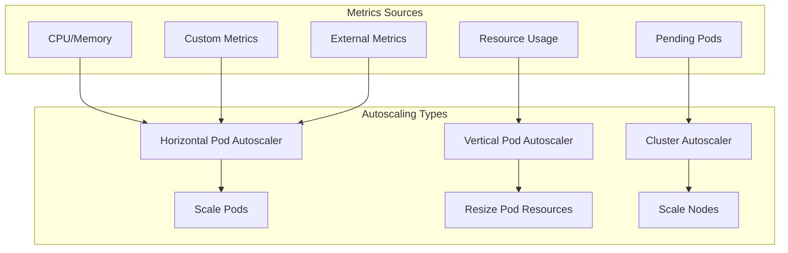

<!--
- Autoscaling in Kubernetes (10 min):

  - Horizontal Pod Autoscaler (HPA):
    - Automatically scales number of pod replicas
    - Based on observed CPU/memory utilization
    - Can use custom metrics from Metrics API
    - Works with Deployments, ReplicaSets, StatefulSets
    - Formula: desiredReplicas = ceil[currentReplicas * (currentMetric/desiredMetric)]
    - Example YAML:
    ```yaml
    apiVersion: autoscaling/v2
    kind: HorizontalPodAutoscaler
    metadata:
      name: app-hpa
    spec:
      scaleTargetRef:
        apiVersion: apps/v1
        kind: Deployment
        name: app-deployment
      minReplicas: 2
      maxReplicas: 10
      metrics:
      - type: Resource
        resource:
          name: cpu
          target:
            type: Utilization
            averageUtilization: 80
    ```
  
  - Vertical Pod Autoscaler (VPA):
    - Adjusts CPU and memory requests/limits
    - Recommends optimal resource settings
    - Can automatically update running pods (requires restart)
    - Good for applications that can't scale horizontally
    - Three modes: Auto, Initial, Off (recommendation only)
  
  - Cluster Autoscaler:
    - Adjusts size of Kubernetes cluster
    - Automatically adds nodes when pods can't be scheduled
    - Removes nodes when they're underutilized
    - Works with cloud providers' node groups/instance groups
    - Respects pod disruption budgets during scale down

  - Best practices:
    - Set appropriate requests and limits for accurate scaling
    - Define both min and max replicas to control scaling range
    - Consider scaling cooldown periods to prevent thrashing
    - Use multiple metrics for comprehensive scaling decisions
    - Test scaling behavior with load tests before production
-->

---

# Services and Load Balancing

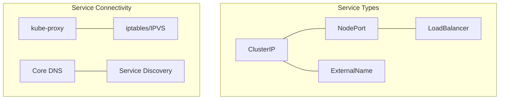

<!--
- Services in Kubernetes (10 min):

  - Service concept:
    - Stable network endpoint for pods
    - Abstracts away pod IP changes and scaling
    - Provides service discovery and load balancing
    - Identified by name in DNS
    - Selects pods using label selectors
  
  - Service types:
    - ClusterIP (default):
      * Internal-only IP address
      * Only accessible within cluster
      * Used for inter-service communication
    
    - NodePort:
      * Exposes service on each node's IP
      * Static port (30000-32767 range)
      * Accessible externally via `<NodeIP>:<NodePort>`
      * Includes ClusterIP service automatically
    
    - LoadBalancer:
      * Provisions external load balancer (cloud-specific)
      * Automatically assigned external IP
      * Routes to NodePort service
      * Simplest way to expose services externally
    
    - ExternalName:
      * Maps service to DNS name
      * Used for external service integration
      * No proxying, just DNS CNAME record
  
  - Service implementation:
    - kube-proxy on each node implements services
    - Three modes: userspace (legacy), iptables (default), IPVS (performance)
    - Creates network rules to redirect traffic
    - Load balancing using different algorithms (depends on mode)
    - Connection tracking for sessionAffinity (session stickiness)
  
  - Example service definition:
  ```yaml
  apiVersion: v1
  kind: Service
  metadata:
    name: web-service
  spec:
    selector:
      app: web
    ports:
    - port: 80
      targetPort: 8080
    type: ClusterIP
  ```
-->

---

# Networking: Ingress and Egress

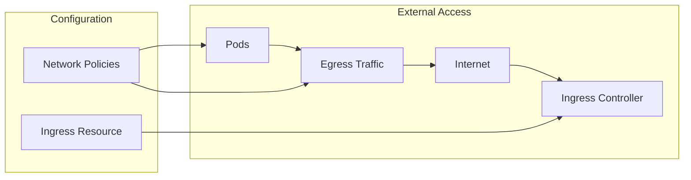

<!--
- Ingress and Egress (10 min):

  - Ingress basics:
    - API object to manage external access to services
    - Typically HTTP/HTTPS traffic routing
    - Provides load balancing, SSL termination, name-based routing
    - Requires Ingress Controller to function
      * Not deployed by default
      * Popular options: Nginx, Traefik, HAProxy, Istio
    - Example Ingress resource:
    ```yaml
    apiVersion: networking.k8s.io/v1
    kind: Ingress
    metadata:
      name: app-ingress
    spec:
      rules:
      - host: app.example.com
        http:
          paths:
          - path: /
            pathType: Prefix
            backend:
              service:
                name: app-service
                port:
                  number: 80
    ```
  
  - Gateway API:
    - Newer Kubernetes API for service networking
    - More expressive and extensible than Ingress
    - Separation of concerns: GatewayClass, Gateway, HTTPRoute
    - Better support for multi-tenant environments
    - Still evolving but gaining adoption
  
  - Egress traffic:
    - Outbound traffic from pods to external services
    - By default, allowed without restrictions
    - Can be controlled with Network Policies
    - Some clusters use egress gateways for additional control
  
  - Network Policies:
    - Kubernetes firewall for pod traffic
    - Defines allowed ingress and egress rules
    - Uses pod/namespace selectors and CIDR blocks
    - Example to restrict egress:
    ```yaml
    apiVersion: networking.k8s.io/v1
    kind: NetworkPolicy
    metadata:
      name: limit-egress
    spec:
      podSelector:
        matchLabels:
          app: web
      policyTypes:
      - Egress
      egress:
      - to:
        - ipBlock:
            cidr: 10.0.0.0/24
      - to:
        - podSelector:
            matchLabels:
              app: api
    ```
-->

---

# DNS for Services and Pods

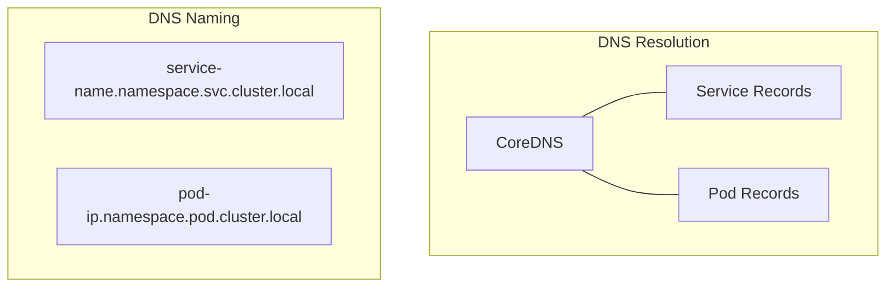

<!--
- DNS in Kubernetes (5 min):

  - CoreDNS:
    - Kubernetes DNS service implementation
    - Service discovery mechanism
    - Runs as Deployment in kube-system namespace
    - Configurable with Corefile
  
  - Service DNS records:
    - Format: <service-name>.<namespace>.svc.cluster.local
    - Short names within same namespace: just <service-name>
    - A/AAAA records point to cluster IP
    - SRV records for named ports
    - Automatic creation and updates
  
  - Pod DNS records:
    - Format: <pod-ip>.<namespace>.pod.cluster.local
    - IP dashes instead of dots (e.g., 10-244-1-10)
    - Must be enabled (not always on by default)
  
  - DNS policies:
    - ClusterFirst: default, try cluster DNS first, then upstream
    - Default: inherit from node
    - ClusterFirstWithHostNet: for pods using host network
    - None: ignore cluster DNS, specify custom nameservers
  
  - Example configuration:
  ```yaml
  apiVersion: v1
  kind: Pod
  metadata:
    name: custom-dns-pod
  spec:
    dnsPolicy: "None"
    dnsConfig:
      nameservers:
        - 8.8.8.8
      searches:
        - ns1.svc.cluster.local
        - my.dns.search.suffix
      options:
        - name: ndots
          value: "2"
  ```
-->

---

# Storage in Kubernetes

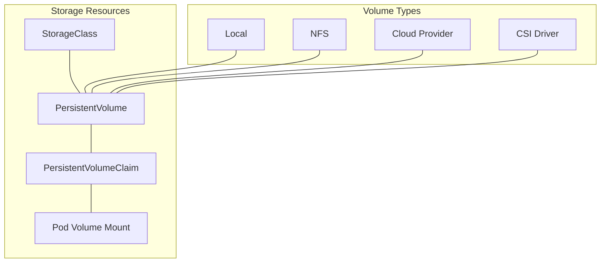

<!--
- Storage in Kubernetes (15 min):

  - Volume basics:
    - Provides persistent storage to pods
    - Data survives container restarts
    - Many volume types: emptyDir, hostPath, nfs, cloud provider volumes
    - Direct pod specification or through PersistentVolumes
  
  - PersistentVolumes (PV):
    - Cluster-wide storage resources
    - Provisioned by administrators or dynamically
    - Independent lifecycle from pods
    - Can be static or dynamic (StorageClass)
    - Access modes: ReadWriteOnce, ReadOnlyMany, ReadWriteMany
  
  - PersistentVolumeClaims (PVC):
    - Request for storage by user
    - Claims a PersistentVolume
    - Pod references PVC, not PV directly
    - Can specify size and access mode requirements
  
  - StorageClass:
    - Defines classes of storage offerings
    - Enables dynamic volume provisioning
    - Specifies provisioner and parameters
    - Different performance characteristics
    - Example: SSD vs HDD storage options
  
  - Container Storage Interface (CSI):
    - Standard for exposing storage systems
    - Allows third-party storage to integrate with Kubernetes
    - Pluggable architecture for storage providers
    - Enables advanced features like snapshots, cloning
  
  - Example PVC and Pod:
  ```yaml
  apiVersion: v1
  kind: PersistentVolumeClaim
  metadata:
    name: data-pvc
  spec:
    accessModes:
      - ReadWriteOnce
    resources:
      requests:
        storage: 10Gi
    storageClassName: standard
  ---
  apiVersion: v1
  kind: Pod
  metadata:
    name: app-with-storage
  spec:
    containers:
    - name: app
      image: app:1.0
      volumeMounts:
      - mountPath: "/data"
        name: data-volume
    volumes:
    - name: data-volume
      persistentVolumeClaim:
        claimName: data-pvc
  ```
-->

---

# Configuration Management

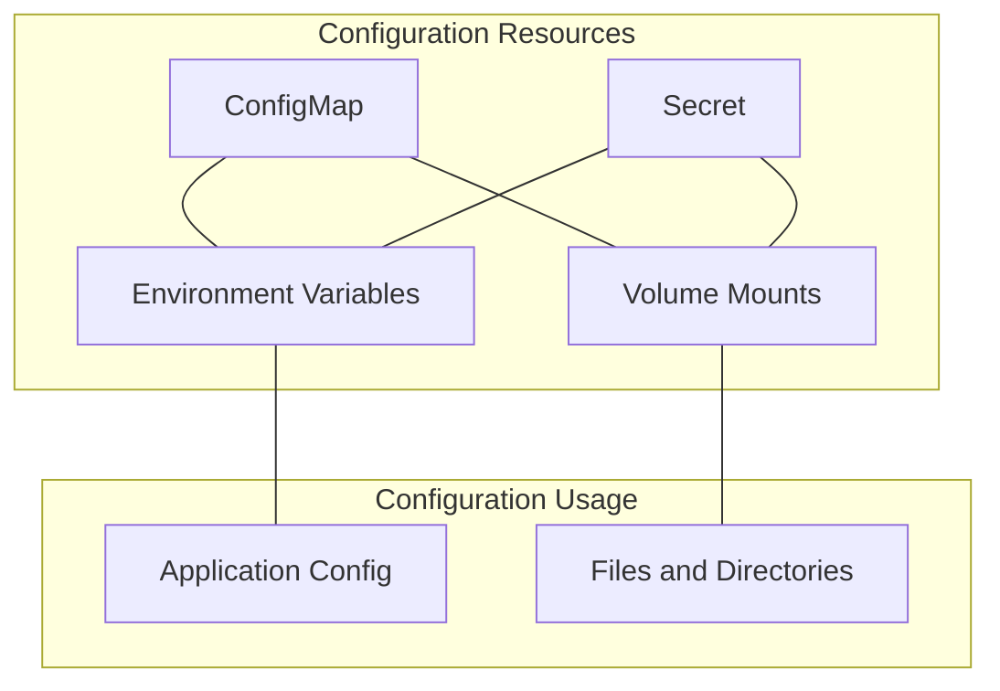

<!--
- Configuration Management (15 min):

  - ConfigMaps:
    - Store non-sensitive configuration data
    - Key-value pairs or files
    - Can be created from literals, files, directories
    - Used as environment variables or volume mounts
    - Updates not automatically reflected in running pods
    - Creation example:
    ```bash
    kubectl create configmap app-config \
      --from-literal=log-level=info \
      --from-literal=environment=dev \
      --from-file=settings.json
    ```
  
  - Secrets:
    - Store sensitive information (passwords, tokens, keys)
    - Base64-encoded in etcd (not encrypted by default)
    - Similar usage to ConfigMaps (env vars or volumes)
    - Types: generic, tls, docker-registry, etc.
    - Best practice: use external secret management
    - Creation example:
    ```bash
    kubectl create secret generic db-creds \
      --from-literal=username=admin \
      --from-literal=password=s3cr3t
    ```
  
  - Using ConfigMaps and Secrets:
    - As environment variables:
    ```yaml
    env:
    - name: LOG_LEVEL
      valueFrom:
        configMapKeyRef:
          name: app-config
          key: log-level
    - name: DB_PASSWORD
      valueFrom:
        secretKeyRef:
          name: db-creds
          key: password
    ```
    
    - As volume mounts:
    ```yaml
    volumes:
    - name: config-volume
      configMap:
        name: app-config
    - name: secret-volume
      secret:
        secretName: db-creds
    volumeMounts:
    - name: config-volume
      mountPath: /etc/config
    - name: secret-volume
      mountPath: /etc/secrets
      readOnly: true
    ```
  
  - Configuration best practices:
    - Separate code from configuration
    - Use namespaces for isolation
    - Consider immutable ConfigMaps for critical configs
    - Use external secret management for sensitive data
    - Implement proper RBAC for access control
    - Version control your configuration
-->

---

# Observability in Service Mesh

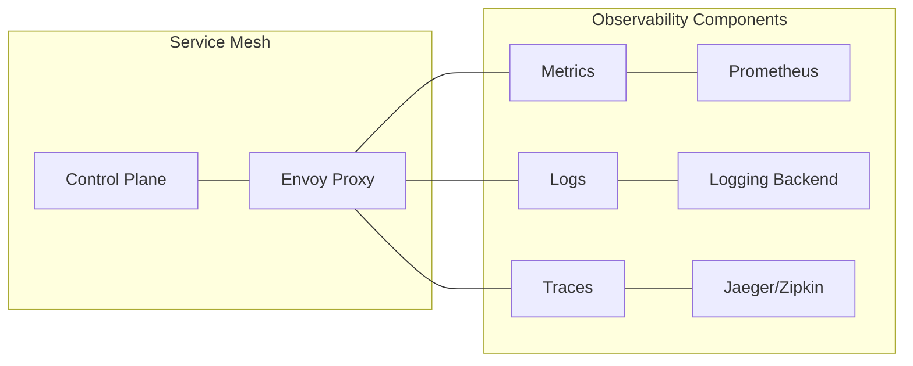

<!--
- Observability in Service Mesh (15 min):

  - Observability pillars:
    - Metrics: numerical data about system behavior
    - Logs: detailed records of events
    - Traces: request flows through distributed system
    - Together provide complete system visibility
  
  - Service mesh observability features:
    - Automatic metrics collection without code changes
    - Consistent telemetry across services
    - Request-level tracing across service boundaries
    - Traffic visualization and service dependency mapping
    - Envoy proxies as unified data collection points
  
  - Key metrics in service mesh:
    - Request count, success rates, error rates
    - Latency (p50, p90, p99 percentiles)
    - Traffic volumes between services
    - Circuit breaker status and events
    - Connection pool statistics
  
  - Distributed tracing:
    - Tracks request propagation across services
    - Identifies bottlenecks and failure points
    - Uses B3 or W3C trace context propagation
    - Visualizes call graphs and timing
    - Implemented via Envoy and collectors
  
  - Visualization tools:
    - Metrics dashboards (Grafana)
    - Service mesh topology (Kiali)
    - Distributed tracing UIs (Jaeger, Zipkin)
    - Log exploration tools (Kibana, Loki)
  
  - Implementation examples:
    - Istio telemetry collection
    - Linkerd metrics API
    - OpenTelemetry integration
    - Prometheus and Grafana deployments
    - Custom metrics and alerts
-->

---
layout: two-cols
---

# Demo: Deploying a Sample Application

```yaml
# Simple application with service
apiVersion: apps/v1
kind: Deployment
metadata:
  name: demo-app
spec:
  replicas: 3
  selector:
    matchLabels:
      app: demo
  template:
    metadata:
      labels:
        app: demo
    spec:
      containers:
      - name: web
        image: nginx:1.19
        ports:
        - containerPort: 80
```

::right::

```yaml
---
apiVersion: v1
kind: Service
metadata:
  name: demo-service
spec:
  selector:
    app: demo
  ports:
  - port: 80
    targetPort: 80
  type: ClusterIP
```

<!--
- Deployment demo (quick demonstration):
  - We'll apply a simple YAML configuration
  - Check the deployment, pods, and service
  - Expose the application
  - Verify everything is working

- Key commands:
  - kubectl apply -f demo.yaml
  - kubectl get deployments,pods,services
  - kubectl port-forward service/demo-service 8080:80
  - Access via browser on localhost:8080

- This is a simple example we'll build on in our lab sessions
-->

---

# Practice Session Preview

In our upcoming lab sessions, we'll:
- Set up a Kubernetes cluster
- Deploy applications with proper configuration
- Implement service mesh for advanced networking
- Configure observability tools
- Practice debugging and troubleshooting

<!--
- Preview of upcoming practical sessions:
  - Session 4-5: Setting up Kubernetes and deploying with Helm
  - Session 6: Clustering Kubernetes
  - Sessions 7-8: Autoscaling, Ingress policies, and HAProxy
  - Sessions 9-10: DNS Setup, Service Discovery, TLS

- Preparation:
  - Review today's concepts
  - Set up a local environment (Minikube, kind, or k3d)
  - Clone the exercise repository
  - Pre-pull common images to save time
-->

---

# Additional Resources

- [Kubernetes Documentation](https://kubernetes.io/docs/)
- [Service Mesh Interface](https://smi-spec.io/)
- [CNCF Landscape](https://landscape.cncf.io/)
- [Istio Documentation](https://istio.io/docs/)
- [Kubernetes Patterns Book](https://www.oreilly.com/library/view/kubernetes-patterns/9781492050278/)
- [Kubernetes Up & Running Book](https://www.oreilly.com/library/view/kubernetes-up-and/9781492046523/)

<!--
- Resources to explore:
  - Official documentation is comprehensive
  - CNCF projects provide specialized tools
  - Books offer deeper architectural insights
  - Online tutorials and labs for hands-on practice
  - Community forums for questions

- Recommended learning path:
  - Master Kubernetes basics first
  - Explore specialized areas (networking, storage)
  - Practice with real applications
  - Study service mesh implementations
  - Join community discussions
-->

---

# Q&A

Let's address any questions you have about today's topics.

<!--
- Encourage questions about any topic covered
- Address common points of confusion
- Connect concepts to real-world scenarios
- Preview what's coming in the next sessions
- Gather feedback on pace and content
-->
