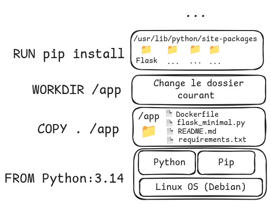

# TP1 - Docker

Objectif du TP :
- :dart: Connaitre les premières commandes linux système
- :dart: Prendre en main les commandes usuelles de Docker
- :dart: Être capable de concevoir une image Docker

## Partie 0 : Prérequis
### Environnnement de travail
Vous allez réaliser une série de TP liés à la contenerisation et la virtualisation en utilisant des outils comme podman et kubernetes. Nous vous demandons d'utiliser un environnement générique commun qui est celui des clés debian étudiées en PIT. Pour travailler, nous vous demandons d'utiliser l'image iso que vous pouvez récupérer avec la commande suivante : `wget https://tc-net.insa-lyon.fr/iso/k3s/2025-k3s.iso`. Cette image doit avoir été flashée sur une clé usb avant la séance. Vous l'aurez également au préalable testé sur votre machine et particulièrement avec une connexion eduroam fonctionnelle. Pour les sauvegardes des configurations vous pouvez monter votre répertoire home partagé de l'INSA dans l'espace de la clé. Lorsque vous booterez la clé, l'intégralité des opérations se fait en mémoire vive de votre machine.   

### Compétences unix
Une fois que votre environnement est démarré, vous devez savoir faire les choses suivantes : 
 - Vérifier qu'un processus de nom <unNom> est actif ou inactif sur votre machine
 - Tuer un processus spécifique et tous ses fils
 - Tuer un processus spécifique directement
 - Verifier l'état d'usage d'un port réseau spécifique de votre machine
 - Vérifier qu'un port spécifique soit bien utilisé par un processus de votre machine
 - Installer un logiciel standard
 - Connaitre la quantité d'espace mémoire restant
 - Manipuler git

Ces actions correspondent à des commandes linux. Lesquelles ?
Vous pouvez maintenant cloner le projet git https://github.com/hreymond/VIR et vous rendre dans le repertoire TP1-Docker.

## Partie 1 : Conteneurs

Vous êtes en charge du déploiement d'un site web.
Ce site assez simple demande à l'utilisateur d'entrer le pseudonyme d'un joueur Minecraft. 


Le site affiche ensuite la tête du joueur en question, et enregistre la requête dans un fichier json : `queried_names.json`. Par défaut, le site écoute sur le port 5000.


Le dossier `website` contient le code du site web (`flask_minimal.py`), la liste des dépendances du site (`requirements.txt`), ainsi qu'un Dockerfile.

Ce fichier `Dockerfile` permet la construction de l'image Docker qui servira de modèle pour la création de conteneurs. Nous reviendrons plus tard sur le contenu de ce fichier.

> [!NOTE] 
>
> **Docker, images et conteneurs**
>
>  Docker ou son équivalent opensource `podman` permet l'exécution de processus de manière isolée dans des **conteneurs**. Ces conteneurs sont dits _self-contained_, c'est à dire qu'ils contiennent toutes les dépendances nécessaire à l'exécution des processus du conteneur. Les conteneurs peuvent executer plusieurs processus concurrents ou bien un seul. 
> 
> Une **image** est un ensemble de fichiers, bibliothèques, binaires et de configurations qui servent de modèle pour la création d'un conteneur.
>
> Dans le cas de notre application web, notre image contient toutes les dépendances (python, paquets pythons, code de l'application). Notre conteneur utilise cette image pour exécuter un processus : notre serveur web.

### Construire une image et lancer un conteneur

Dans le répertoire `website`

- Lancer `podman build . -t website` pour construire une image nommée `website` à partir du `Dockerfile`.
- Avec `podman image list`, vérifier que l'image existe bien.
- Lancer `podman run website`, pour créer un conteneur à partir de l'image `website`. Le serveur devrait se lancer et écouter sur le port 5000 (`running on http://<ip>:5000`).

> [!NOTE] 
>
>  **Redirection de ports**
>
> Si vous essayez d'accéder au site web depuis votre ordinateur, cela ne fonctionnera pas. Le serveur web écoute bien sur le port 5000, mais il est uniquement accessible au sein du réseau docker, et pas depuis votre machine hôte (pour vous en convaincre, vous pouvez regarder les ports actifs sur votre machine avec `netstat -tlnp`).
>
> Pour rendre le serveur accessible depuis l'extérieur du conteneur, il est nécessaire faire une redirection de port (_port-forwarding_ en anglais). L'objectif est que le réseau trafic entrant sur le port 5000 de notre machine soit redirigé vers le port 5000 du conteneur. Pour cela, on doit relancer notre conteneur.

- Arrêter le conteneur Ctrl-c
- Relancer le conteneur en arrière plan (option `-d`), en ajoutant la redirection de port :  `docker run -d -p 5000:5000 website`.

### Inspecter les conteneurs

- Dans un autre terminal, lancer `docker container list -a`, vérifier
  que votre conteneur est présent, et à l'état "UP". Noter le nom de votre conteneur.
  Vous remarquerez que votre précédent conteneur n'a pas été supprimé (status Exited).

- Vérifiez que le serveur s'est bien lancé : `docker logs <nom du conteneur>`
- Vérifiez que le port 5000 est bien ouvert sur votre machine : `netstat -tln`

Vous pouvez alors accéder à votre site depuis un navigateur (adresse `http://localhost:5000`).
- Tester le site avec plusieurs pseudos (le votre si vous en avez, sinon `Aypierre` par exemple).

Le site enregistre les statistiques des requêtes effectués dans un fichier nommé `queried_names.json`. Nous allons vérifier que le fichier est bien créé à l'aide de la commande `docker exec`, qui permet d'exécuter une commande au sein d'un conteneur.

- Executer `docker exec -it <nom du conteneur> bash`, pour obtenir un terminal bash au sein de votre conteneur. Verifiez que le fichier `queried_names.json` existe, ainsi que son contenu.
- Arrêter et supprimer le conteneur (`docker stop`, `docker rm`)

### Persistance des données

- Démarrer un nouveau conteneur : `docker run -d -p 5000:5000 website`. Est-ce que le fichier `queried_names.json` est toujours présent dans le conteneur ?

> [!NOTE]
>
> **Stockage persistent : les volumes**
>
> Par défaut, chaque conteneur docker a son propre système de fichier, qui est supprimé en même temps que le conteneur. C'est une limitation dans plusieurs cas :
> - Lorsque l'on souhaite sauvegarder des données entre deux exécutions d'un conteneur, comme dans notre cas avec le fichier `queried_names.json`
> - Lorsque l'on souhaite partager des données entre plusieurs conteneurs.
>
> Pour résoudre ces problèmes, on utilise des _volumes_.
  Les volumes sont des stockages persistants, gérés par docker. Par défaut, le contenu d'un volume est stocké sous la forme dans un dossier sur votre machine (usuellement `~/.local/share/containers/storage/volumes`), mais il peut aussi être hebergé ailleurs (serveur NFS, Amazon S3,...).
>
> Pour monter un volume avec docker, on utilise le paramètre `--volume <v-name>:<mount-path>` avec `v-name` le nom souhaité pour le volume, et `mount-path` le chemin auquel le volume sera rattaché à l'intérieur du conteneur.
>
> Plus d'informations sur les [volumes ici](https://docs.docker.com/engine/storage/volumes/). Il est aussi possible de partager un dossier avec un conteneur via des [_bind mounts_](https://docs.docker.com/engine/storage/bind-mounts/")

- Lancer un conteneur avec un volume nommé `app_data` qui stockera le contenu du dossier `/app` (qui contient le fichier `queried_names.json`)
- Rechercher quelques nom d'utilisateurs, pour ajouter des statistiques à `queried_names.json`
- Supprimer le conteneur `docker rm -f <nom conteneur>` (`-f` permet de forcer l'arrêt du conteneur)
- Lancer un nouveau conteneur, toujours avec le même volume. Est-ce que le fichier `queried_names.json` est toujours présent dans le conteneur ?

:white_check_mark: Le site web est déployé, et ses données persistées !

## Partie 2 : Création d'images

L'équipe de développement s'est rendu compte des limitations d'utiliser un fichier json comme base de donnée. 
Ils ont donc sorti une nouvelle version du site web, qui utilise une base de donnée maison : "SuperDB".
Cette fois ci, c'est à vous de créer l'image Docker.

## Anatomie d'une Image Docker

### Choix d'une image de base

Pour commencer, déchiffrons le `Dockerfile` actuel, étape par étape :

```dockerfile
# Start with a base image
FROM python:3.14-slim
```

Un Dockerfile commence toujours par la même instruction `FROM <image>`. 
Cette ligne permet de spécifier une image de base, qui servira de fondation pour notre nouvelle image. Cette image de base contient un système d'exploitation et des outils essentiels. Ici, nous utiliserons l'image `python:3-14-slim`, une distribution linux très légère qui inclut Python.

### Installation des dépendances 

La suite du `Dockerfile` s'intéresse à l'installation des dépendances :

```dockerfile
# Copy the application content COPY <src> <dst>
COPY . /app

# Set up our working directory
WORKDIR /app

# Install the Python packages we need
RUN pip install -r requirements.txt
```

Tout d'abord, on copie le contenu du dossier actuel (requirements.txt, flask_minimal.py, ...) dans le dossier `app/` de notre image. 
Ensuite, on définit `/app` comme dossier courant.
Enfin, on installe les dépendances de notre application python, listées dans le fichier `requirements.txt`.

### Configuration 

```dockerfile
# Tell Flask which application to run
ENV FLASK_APP=flask_minimal.py

# Specify the command to start our application
CMD ["flask", "run", "--host=0.0.0.0"]
```

Pour définir des variable d'environnement nécessaires à l'application, on utilise l'instruction `ENV`. Ici, on définit la variable `FLASK_APP` utilisée par le framework web Flask pour savoir quelle application lancer.

Enfin, on définit la commande qui sera utilisée pour lancer notre application, ici `flask run --host=0.0.0.0`.

## Comprendre les layers

La construction d'une image docker s'effectue par l'ajout de couches ou _layers_, à l'image de base.
Chaque _layer_ représente un ensemble de modifications (ajout, suppression, modification) apportées au _layer_ précédent.

Par exemple, pour notre image
- la couche correspondant à l'instruction `COPY` ajoute 4 fichiers à l'image de base.
- la couche `RUN pip install ...` ajoute les modules python nécessaires. Pour cela, elle dépend du fichier `requirements.txt` apportés par la couche `COPY`



À noter que l'image `python` que l'on utilise est elle-même dérivée d'une image de base `debian`, à laquelle on a ajouté plusieurs couches correspondant à l'installation de Python.
 
Pour éviter d'avoir à reconstruire l'entièreté de l'image à chaque  `docker build .`, Docker garde en cache les différentes couches.

À votre tour :
- Relancer la construction de l'image : docker vous informe qu'il utilise les couches déjà construites avec `Using cache ...` 

- Modifier le fichier "Readme.md" dans `website`, et relancer la création d'une image. 

La construction de la couche `COPY . .` est relancée car un des fichiers copiés est modifié. Dans ce cas, les couchent suivantes, qui dépendent de `COPY`, sont relancées.  Est-ce pertinent de relancer l'installation des paquets python pour une modification du Readme ?

- Modifier le Dockerfile de manière à ce que l'installation des paquets python (couche `RUN pip install ...`) ne soit relancée que si le fichier `requirements.txt` est mis à jour.


# À vous de jouer !

La nouvelle version du site web est dans le répertoire `website-v2`.
Les source du logiciel "SuperDB" sont dans le répertoire SuperDB.

En vous aidant du [Readme.md](website-v2/README.md) de website-v2, modifier le Dockerfile pour :
- Installer les dépendances pour compiler SuperDB
- Compiler le superDb.c pour produire l'exécutable superDBExe
- Construire la nouvelle image, et la tagger `v2` : `docker build . -t website:v2`

- Une fois l'image conçue, vérifier que tout fonctionne : le site démarre, fonctionne, et le fichier `queried_names.txt` est bien créé.

:white_check_mark: La version 2 du site web est déployée !

# BONUS

Si vous souhaitez améliorer l'image actuelle, vous pouvez accomplir ces tâches secondaires : 

- Add an HealthCheck to your website : https://docs.docker.com/reference/dockerfile/#healthcheck
- Do not expose port manually, instead use the EXPOSE command : https://docs.docker.com/reference/dockerfile/#expose et https://docs.docker.com/get-started/docker-concepts/running-containers/publishing-ports/
- Run performance tests on the V1 and V2 versions <TODO quels outils ?  >
- Mettre en place de l'intégration continue : faire un fork de ce dépôt sur github ou gitlab, et faire en sorte que chaque nouveau commit sur `main` déclenche la création de l'image docker de website. 
  - Sur github, en utilisant les github actions : [https://docs.github.com/en/actions/get-started/understand-github-actions](https://docs.github.com/en/actions/get-started/understand-github-actions)
  - Sur gitlab, en utilisant une pipeline de CI/CD : [https://docs.gitlab.com/ci/](https://docs.gitlab.com/ci/)

# TODO TP

- [ ] Regarder les outils de stress test simples d'utilisation qui existent

# Liste des commandes utiles
```
  ps -ef | grep <NomProg>
  kill <idProcessus>
  killall <nomProcessus>
  kill -9 <idProcessus>
  killall -9 <nomProcessus>

  netstat -tlnp | grep <portId>
  lsof -i :5000

  apt install <logiciel>

  top | htop
  git clone <url>
```

# Liste des packages contenant des utilitaires utiles
```
  netstat --> net-tools
  ps --> procps
``` 
